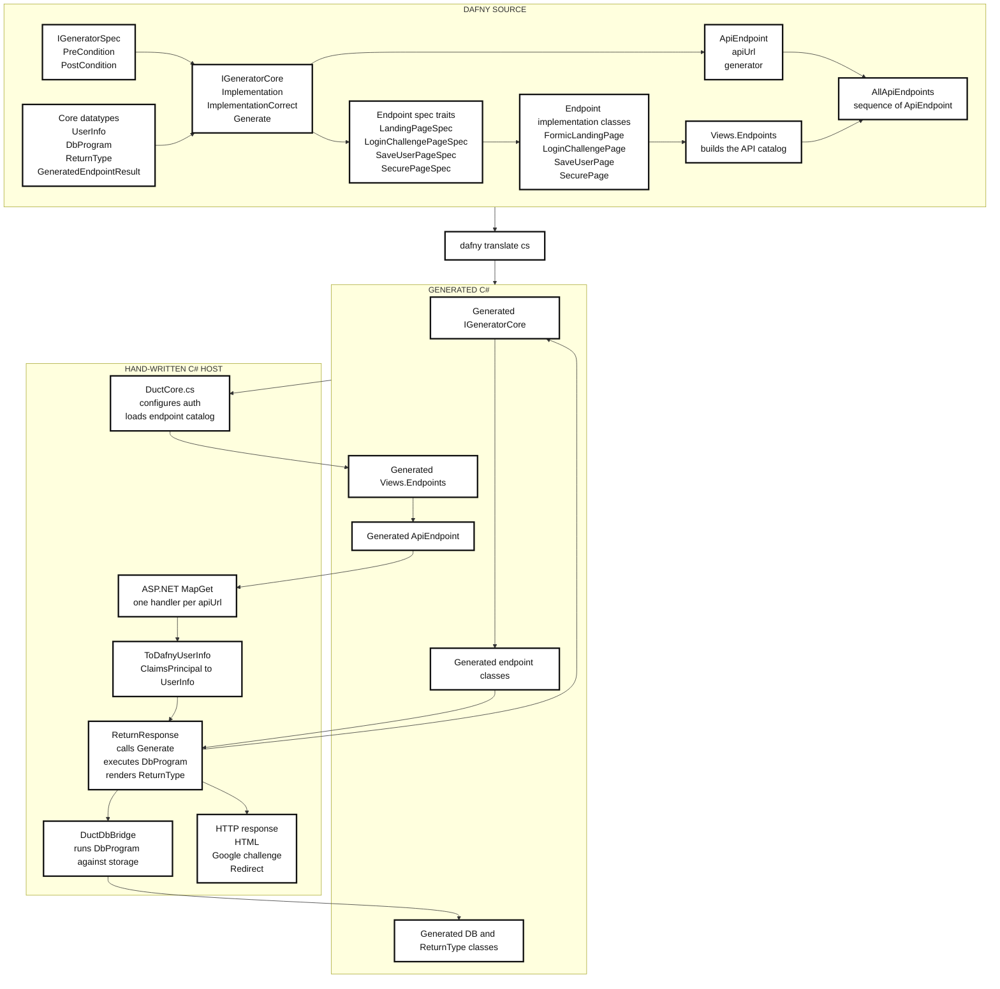
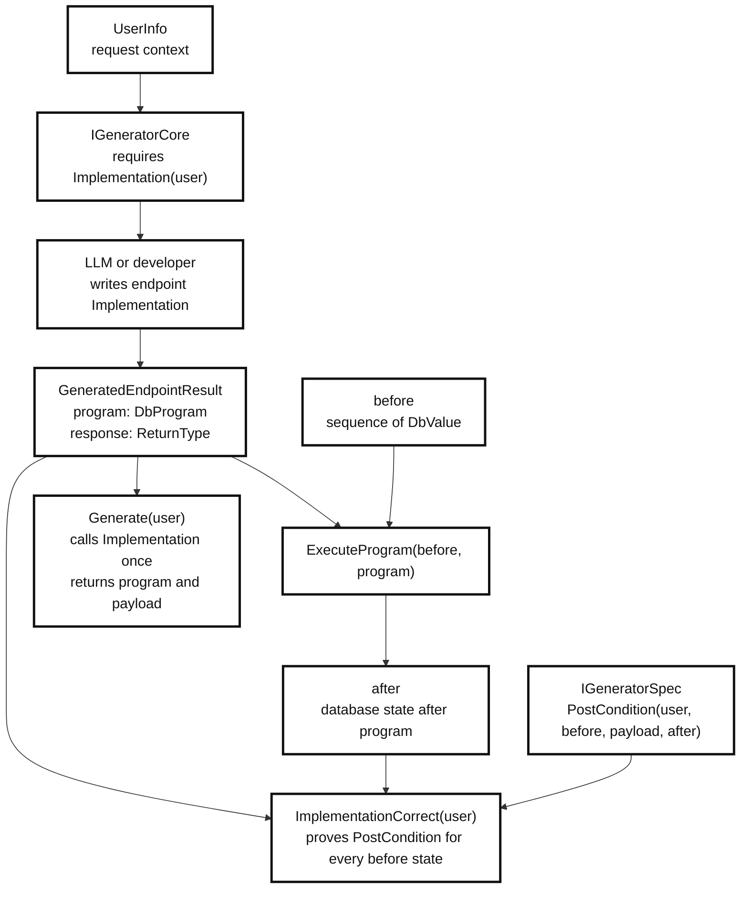
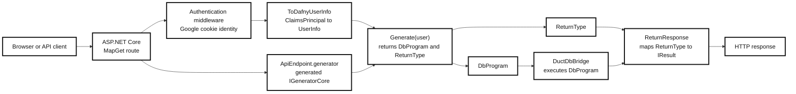

# Duct Project Architecture

Duct is a backend framework that enables the development of web funtionality via formal specifications.
The philosophy behind this project is that specifications are an abstraction layers for LLM generated code.
I want to leverage the generative capabilities of LLMS as well as the power that comes with abstract formalizations.

A programmer defines web API behavior in Dafny; an LLM verifies that endpoint
implementations satisfy the dafny specifications, translates the Dafny code into C# to be run with 
ASP.NET Core.

## Diagrams

### End-To-End Architecture



### Dafny Proof Contract



### Runtime Request Flow



## Core Contracts

`IGeneratorSpec` defines what an endpoint must guarantee:

```dafny
PostCondition(
  u: UserInfo,
  before: seq<DbValue>,
  payload: ReturnType,
  after: seq<DbValue>)
```

`IGeneratorCore` requires the implementation function:

```dafny
function Implementation(u: UserInfo): GeneratedEndpointResult
```

`ImplementationCorrect` connects that implementation to the spec:

```dafny
forall before: seq<DbValue> ::
  PostCondition(
    u,
    before,
    Implementation(u).response,
    ExecuteProgram(before, Implementation(u).program))
```

`Generate` is intentionally thin. It evaluates the implementation once and
returns the two values needed by the host:

```dafny
method Generate(u: UserInfo) returns (prog: DbProgram, payload: ReturnType)
```

`ApiEndpoint` is only route metadata plus the generator:

```dafny
class ApiEndpoint {
  var apiUrl: string
  var generator: IGeneratorCore
}
```

The hand-written C# host owns HTTP concerns: authentication, route registration,
claim conversion, database bridge execution, and conversion from `ReturnType` to
an ASP.NET `IResult`.