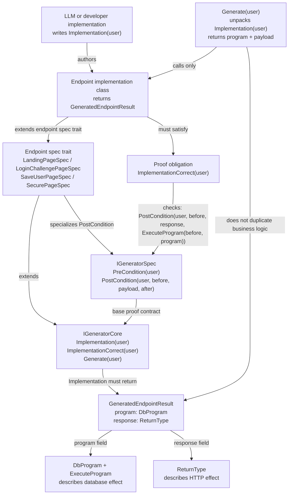
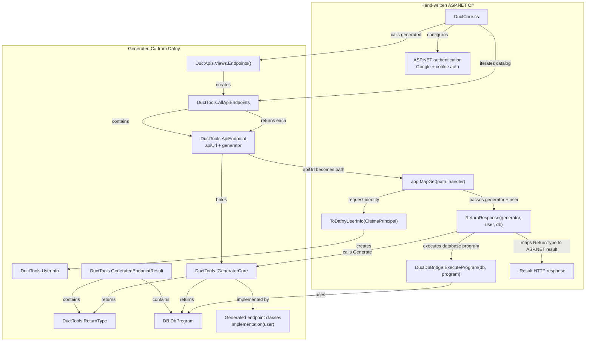

# Duct Project Architecture

This project defines web API behavior in Dafny, verifies that endpoint
implementations satisfy their postconditions, translates the Dafny code into C#,
and hosts the generated logic with ASP.NET Core.

The key split is:

- Dafny source code defines specs, implementations, database programs, and API metadata.
- Generated C# mirrors the Dafny classes and datatypes.
- Hand-written C# hosts the generated logic as HTTP routes.

## End-To-End Box Diagram

Every important class, trait, or runtime component is shown as a box. Arrows
describe ownership, inheritance, calls, or translation boundaries.

```mermaid
%%{init: {
  "theme": "base",
  "themeVariables": {
    "fontFamily": "Arial",
    "fontSize": "22px",
    "primaryTextColor": "#111827",
    "lineColor": "#374151"
  },
  "flowchart": {
    "htmlLabels": true,
    "nodeSpacing": 70,
    "rankSpacing": 95,
    "curve": "basis"
  }
}}%%
flowchart LR
    subgraph DAFNY["Dafny source code (.dfy)"]
        direction TB

        DB["<b>DB module</b><br/>DbValue, DbKey, DbProgram<br/>ExecuteProgram(before, program)"]
        USER["<b>UserInfo datatype</b><br/>name<br/>email<br/>picture<br/>authenticated"]
        RT["<b>ReturnType datatype</b><br/>Content(body)<br/>ChallengeGoogle(returnUrl)<br/>Redirect(url)"]
        GER["<b>GeneratedEndpointResult datatype</b><br/>program: DbProgram<br/>response: ReturnType"]

        SPEC["<b>IGeneratorSpec trait</b><br/>PreCondition(user)<br/>PostCondition(user, before, payload, after)"]
        CORE["<b>IGeneratorCore trait</b><br/>Implementation(user)<br/>ImplementationCorrect(user)<br/>Generate(user)"]

        LANDSPEC["<b>LandingPageSpec trait</b><br/>specializes landing page postcondition"]
        LOGINSPEC["<b>LoginChallengePageSpec trait</b><br/>specializes login challenge postcondition"]
        SAVESPEC["<b>SaveUserPageSpec trait</b><br/>specializes save-user postcondition"]
        SECURESPEC["<b>SecurePageSpec trait</b><br/>specializes secure page postcondition"]

        LANDIMPL["<b>FormicLandingPage class</b><br/>Implementation(user)<br/>returns content page result"]
        LOGINIMPL["<b>LoginChallengePage class</b><br/>Implementation(user)<br/>returns Google challenge result"]
        SAVEIMPL["<b>SaveUserPage class</b><br/>Implementation(user)<br/>ProveImplementationCorrect(user)"]
        SECUREIMPL["<b>SecurePage class</b><br/>Implementation(user)<br/>returns content or challenge"]

        PATH["<b>apiUrl string</b><br/>route path metadata<br/>/, /login, /save_user, /secure"]
        API["<b>ApiEndpoint class</b><br/>apiUrl: string<br/>generator: IGeneratorCore"]
        CATALOG["<b>AllApiEndpoints class</b><br/>endpoints: seq of ApiEndpoint<br/>Add | Count | Get"]
        VIEWS["<b>Views class</b><br/>Endpoints()<br/>builds the Dafny API catalog"]
    end

    TRANSLATOR["<b>dafny translate cs</b><br/>translation step<br/>Dafny source becomes generated C#"]

    subgraph GENERATED["Generated C# code<br/>formic_site_duct/converted_duct/formic_duct.cs"]
        direction TB

        GDB["<b>Generated DB types</b><br/>DbProgram<br/>DbValue<br/>ExecuteProgram helpers"]
        GCORE["<b>Generated IGeneratorCore interface</b><br/>Implementation(user)<br/>Generate(user, out program, out payload)"]
        GIMPLS["<b>Generated endpoint classes</b><br/>FormicLandingPage<br/>LoginChallengePage<br/>SaveUserPage<br/>SecurePage"]
        GAPI["<b>Generated ApiEndpoint</b><br/>apiUrl<br/>generator"]
        GVIEWS["<b>Generated Views.Endpoints()</b><br/>builds generated endpoint catalog"]
    end

    subgraph HOST["Hand-written C# host<br/>formic_site_cs"]
        direction TB

        PROGRAM["<b>DuctCore.cs / Program</b><br/>configures auth<br/>loads Views.Endpoints()"]
        MAPGET["<b>ASP.NET MapGet handlers</b><br/>one route per ApiEndpoint.apiUrl"]
        CLAIMS["<b>ClaimsPrincipal to UserInfo</b><br/>name<br/>email<br/>picture<br/>authenticated"]
        RETURNRESP["<b>ReturnResponse(generator, user, db)</b><br/>calls Generate<br/>executes DbProgram<br/>renders ReturnType"]
        DBBRIDGE["<b>DuctDbBridge.cs</b><br/>executes generated DbProgram<br/>against storage"]
        HTTP["<b>HTTP client response</b><br/>HTML content<br/>Google challenge<br/>redirect"]
    end

    SPEC -->|"is extended by"| CORE
    CORE -->|"requires implementation to return"| GER
    GER -->|"contains"| DB
    GER -->|"contains"| RT
    CORE -->|"reads"| USER
    CORE -->|"ImplementationCorrect checks PostCondition over ExecuteProgram"| SPEC
    SPEC -->|"PostCondition mentions before/after database state"| DB

    LANDSPEC -->|"extends"| CORE
    LOGINSPEC -->|"extends"| CORE
    SAVESPEC -->|"extends"| CORE
    SECURESPEC -->|"extends"| CORE

    LANDIMPL -->|"extends"| LANDSPEC
    LOGINIMPL -->|"extends"| LOGINSPEC
    SAVEIMPL -->|"extends"| SAVESPEC
    SECUREIMPL -->|"extends"| SECURESPEC

    SAVEIMPL -->|"proof establishes"| CORE

    API -->|"stores route string"| PATH
    API -->|"stores generator"| CORE
    CATALOG -->|"contains many"| API
    VIEWS -->|"creates catalog with endpoint boxes"| CATALOG
    VIEWS -->|"binds / to"| LANDIMPL
    VIEWS -->|"binds /login to"| LOGINIMPL
    VIEWS -->|"binds /save_user to"| SAVEIMPL
    VIEWS -->|"binds /secure to"| SECUREIMPL

    VIEWS -->|"included in translation input"| TRANSLATOR
    CORE -->|"included in translation input"| TRANSLATOR
    DB -->|"included in translation input"| TRANSLATOR
    TRANSLATOR -->|"emits generated C# boxes"| GVIEWS
    TRANSLATOR -->|"emits generated C# boxes"| GCORE
    TRANSLATOR -->|"emits generated C# boxes"| GDB
    DB -->|"translated into"| GDB
    CORE -->|"translated into"| GCORE
    LANDIMPL -->|"translated into"| GIMPLS
    LOGINIMPL -->|"translated into"| GIMPLS
    SAVEIMPL -->|"translated into"| GIMPLS
    SECUREIMPL -->|"translated into"| GIMPLS
    API -->|"translated into"| GAPI
    VIEWS -->|"translated into"| GVIEWS

    PROGRAM -->|"calls"| GVIEWS
    GVIEWS -->|"returns generated catalog of"| GAPI
    GAPI -->|"provides apiUrl to"| MAPGET
    GAPI -->|"provides generator to"| RETURNRESP
    MAPGET -->|"creates user from request"| CLAIMS
    CLAIMS -->|"passes generated UserInfo to"| RETURNRESP
    RETURNRESP -->|"calls generated Generate"| GCORE
    GCORE -->|"dispatches to generated Implementation"| GIMPLS
    GIMPLS -->|"returns generated DbProgram + ReturnType"| RETURNRESP
    RETURNRESP -->|"sends program to"| DBBRIDGE
    DBBRIDGE -->|"executes"| GDB
    RETURNRESP -->|"turns ReturnType into"| HTTP

    classDef dafnyBox fill:#eef6ff,stroke:#1d4ed8,stroke-width:3px,color:#111827,font-size:22px;
    classDef generatedBox fill:#ecfdf5,stroke:#047857,stroke-width:3px,color:#111827,font-size:22px;
    classDef hostBox fill:#fff7ed,stroke:#c2410c,stroke-width:3px,color:#111827,font-size:22px;
    classDef bridgeBox fill:#f5f3ff,stroke:#6d28d9,stroke-width:4px,color:#111827,font-size:24px;

    class DB,USER,RT,GER,SPEC,CORE,LANDSPEC,LOGINSPEC,SAVESPEC,SECURESPEC,LANDIMPL,LOGINIMPL,SAVEIMPL,SECUREIMPL,PATH,API,CATALOG,VIEWS dafnyBox;
    class GDB,GCORE,GIMPLS,GAPI,GVIEWS generatedBox;
    class PROGRAM,MAPGET,CLAIMS,RETURNRESP,DBBRIDGE,HTTP hostBox;
    class TRANSLATOR bridgeBox;
```



## Dafny Spec And Implementation Relationship

This diagram focuses only on Dafny. The specs define the contract. The endpoint
classes implement the contract. `ImplementationCorrect` is the proof bridge.



## C# Runtime Relationship

This diagram focuses only on generated and hand-written C#.



## Core Contracts

`IGeneratorSpec` defines what an endpoint must guarantee:

```dafny
PostCondition(
  u: UserInfo,
  before: seq<DbValue>,
  payload: ReturnType,
  after: seq<DbValue>)
```

`IGeneratorCore` requires the implementation function:

```dafny
function Implementation(u: UserInfo): GeneratedEndpointResult
```

`ImplementationCorrect` connects that implementation to the spec:

```dafny
forall before: seq<DbValue> ::
  PostCondition(
    u,
    before,
    Implementation(u).response,
    ExecuteProgram(before, Implementation(u).program))
```

`Generate` is intentionally thin. It evaluates the implementation once and
returns the two values needed by the host:

```dafny
method Generate(u: UserInfo) returns (prog: DbProgram, payload: ReturnType)
```

`ApiEndpoint` is only route metadata plus the generator:

```dafny
class ApiEndpoint {
  var apiUrl: string
  var generator: IGeneratorCore
}
```

The hand-written C# host owns HTTP concerns: authentication, route registration,
claim conversion, database bridge execution, and conversion from `ReturnType` to
an ASP.NET `IResult`.
